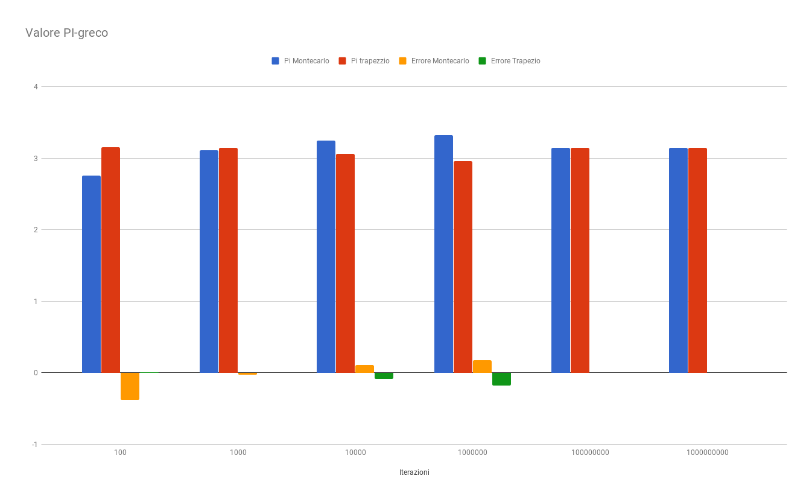
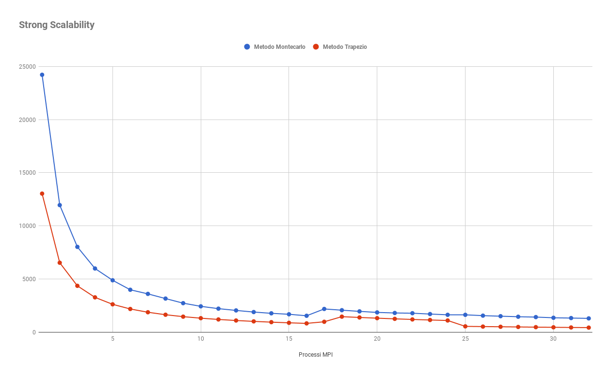
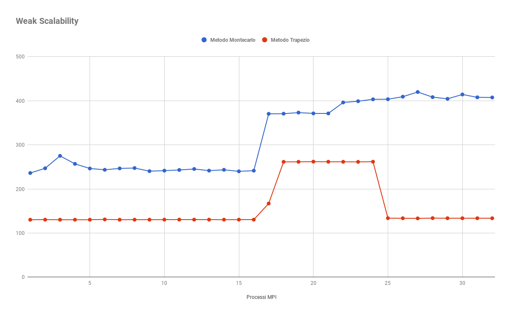

# Progetto PCPC

**Studente:** Giovanni Leo

**Matricola:** 0522500538

**Problema assegnato:** PI Computation utilizzando il metodo del trapezio e il metodo di montecarlo, modalità di comunicazione point-to-point, test su macchine m4.xlarge di amazon (dimensione massima cluster 8 nodi). 

 In analisi numerica, la regola del trapezio fornisce un procedimento per il calcolo approssimato del PI-greco. 

Il metodo di montecarlo raggruppa una ampia classe di metodi computazionali basati sul campionamento casuale per ottenere risultati numerici, in questo caso il PI-greco.

Il programma che presento è in grado di equidistribuire un qualsiasi numero di iterazioni tra i processi MPI scelti, anche nel caso in cui il numero delle iterazioni non è divisibile per il numero dei processi stessi. Sono stati calcolati i tempi di esecuzione del programma non considerando la divisione del lavoro fra i processori ma considerando solo la computazione del PI-greco per entrambi i metodi.

All' interno di ogni iterazione, un processo MPI :

- per il metdo del trapezio verrà eseguita questa computazione:

  ```C
  for (i=start; i<=stop; i+=1)
  {
  	x2=d2*i*i;
  	result+=1.0/(1.0+x2);
  
  }
  piSum=result;
  ```

  In seguito gli slave invieranno il `piSum` al master il quale andrà a sommare tali valore con quello da lui computato ed eseguirà tale operazione  `pi = 4*d*piSum;`che serve a calcolare il pi greco.

- per il metodo montecarlo verrà eseguita questa computazione:

  ```C
  for ( i=start; i<=stop; i++) {
  	x = (double)rand()/RAND_MAX;
  	y = (double)rand()/RAND_MAX;
  	z = x*x+y*y;
  	if (z<=1) count++;
  
  }
  
  piSum=count;
  ```
  In seguito gli slave invieranno il `piSum` al master il quale andrà a sommare tali valore con quello da lui computato ed eseguirà tale operazione  `pi = (piSum*4)/N;` che serve a calcolare il pi greco.

### Risultati

#### Valore PI-greco



Sull'asse delle x abbiamo il numero di iterazioni e sull'asse delle y il valore di pi-greco. L' approssimazione del  valore del pi-greco è stata computata con un numero di iterazioni  che va 100 a 10000000000 e con quest'ultimo numero di iterazioni l'approssimazione del valore del pi-greco è la più accurata per entrambi i metodi. 

#### Strong scalability



Sull'asse delle y abbiamo il tempo in millisecondi, mentre sull'asse delle x abbiamo il numero di processi MPI. I test sono stati soddisfacenti, mostrando una grande scalabilità del codice. Il tempo di esecuzione è passato da circa 24222 millisecondi utilizzando un solo processo mpi fino ad arrivare a circa 1285 millisecondi con 32 processi mpi per il metodo di montecarlo; per il metodo del trapezio il tempo di esecuzione è passato da circa 13033  millisecondi utilizzando un solo processo mpi fino ad arrivare a circa 416 millisecondi con 32 processi mpi. Il tutto sul di un numero di iterazioni pari ad 10000000000.

#### Weak scalability



Sull'asse delle y abbiamo il tempo in millisecondi, mentre sull' asse delle x abbiamo il numero di processi mpi. In questo tipo di test ci aspettiamo una linea orizzontale, assicurandoci che aumentando la taglia dell' input e il numero di processi mpi, in modo tale che il rapporto tra i due sia costante, il tempo del programma rimane invariato. Utilizzando lo scambio di messaggi previsti da mpi, ovviamente, il tempo non può essere costante perché spendiamo tempo per scambiare dati tra i processi. In tale test il numero di iterazioni iniziali N è 10000000 e tale numero viene aumentato in relazione al numero di processi utilizzati seguendo questa formula **np*N** dove **np** è il numero di processi.

##### Considerazioni

Dai test si è notato un peggioramneto delle prestazioni utilizzando dai 17 ai 25 processi mpi per risolvere il problema. Ma dai 26 processi mpi in poi  le performance sono migliorate, ciò forse è dovuto all'hypertreding dei processori.


### **Compilazione**

Il programma sorgente è stato scritto utilizzando le librerie standard di c, quindi in fase di compilazione basta eseguire il  comando:

```
mpicc PIComputation.c –o (nome eseguibile) -lm
```

Per la compilazione è utilizzato il comando `-lm` per trovare la libreria `math.h`.

Il file sorgente è stato compilato e eseguito correttamente sulle macchine di Amazon, quindi per chiunque dovesse rieseguire tale codice, non dovrebbe incontrare nessun problema relato a tali passi.

### **Esecuzione**

Supponendo che il file compilato venga denominato "PIComputation " è possibile lanciare il programma attraverso tale comando su aws:

```
 mpirun -np x --host IpMaster,IpSlaves PIComputation y z
```

Invence se lo si vuole lanciare in locale:

```
 mpirun -np x PIComputation y z
```

- **x**: Indica il numero di processi mpi che si vuole lanciare.
- **y**: Indica un volore che può assumere valori da 1 a 8 e **deve essere specificato** **affiché il programma funzioni**  **correttamente**:
  - Se il valore è 1 allora il numero di iterazioni per il metodo del trapezio e montecarlo sarà 100.
  - Se il valore è 2 allora il numero di iterazioni per il metodo del trapezio e montecarlo sarà 1000.
  - Se il valore è 3 allora il numero di iterazioni per il metodo del trapezio e montecarlo sarà 10000.
  - Se il valore è 4 allora il numero di iterazioni per il metodo del trapezio e montecarlo sarà 100000.
  - Se il valore è 5 allora il numero di iterazioni per il metodo del trapezio e montecarlo sarà 1000000.
  - Se il valore è 6 allora il numero di iterazioni per il metodo del trapezio e montecarlo sarà 10000000.
  - Se il valore è 7 allora il numero di iterazioni per il metodo del trapezio e montecarlo sarà 100000000.
  - Se il valore è 8 allora il numero di iterazioni per il metodo del trapezio e montecarlo sarà 1000000000.
  - Se non viene specificato nessun valore fra quelli sopra elencati allora il numero di iterazioni per il metodo del trapezio e montecarlo saranno 10000000 iterazioni, ignora il fattore moltiplicativo a differenza di quelli sopra elencati.
- **z**: Indica un fattore moltiplicaticativo per la taglia dell'input **utilizzato solo al fine dei test su Amazon**  inoltre non sono stati effuttuati controlli sull'input poichè utilizzata solo a questo fine. **Si consiglia di lanciale il progamma in locale con tale parametro settato ad 1 poichè gli altri valori sono serviti solo ed esclusivamente per i test su Amazon**.

Nel comando per lanciare il programma su aws è stato specificato `IPSlaves` poichè dobbiamo inserire gli ip locali relativi alle 7 macchine slave.